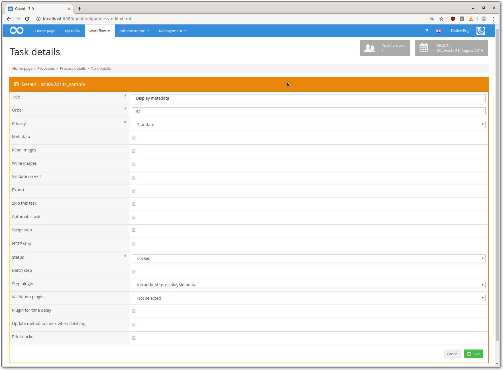
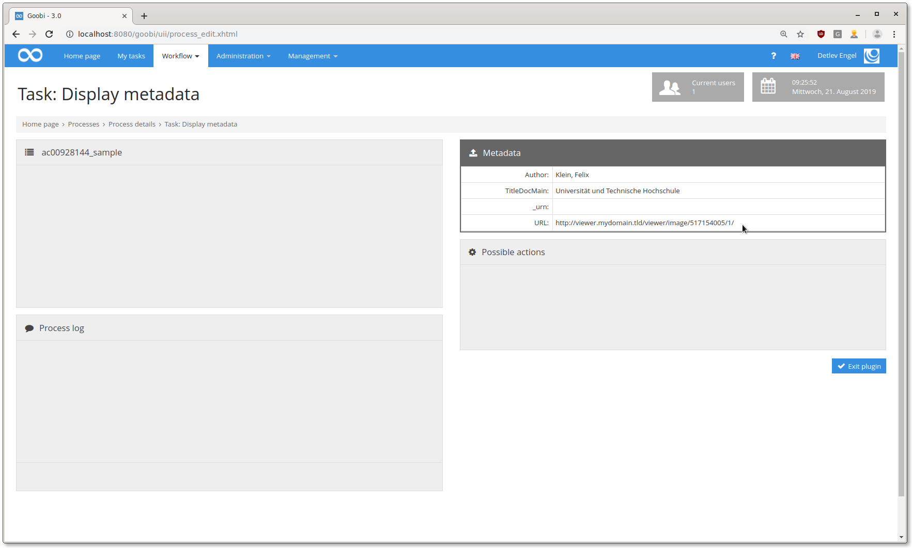

## Einführung
Die vorliegende Dokumentation beschreibt die Installation, Konfiguration und den Einsatz eines Plugins zur Anzeige von Metadaten und Ordnerinhalten in einem Workflow-Schritt. Das Plugin kann beliebige Metadaten und Ordnerinhalte in einem Schritt anzeigen. Die Konfiguration von Prä- und Suffixen für die angezeigten Metadaten ist auch möglich.


## Installation 
Zur Nutzung des Plugins müssen die beiden Artefakte an folgende Orte kopiert werden:

```bash
/opt/digiverso/goobi/plugins/step/plugin_intranda_step_displayMetadata-base.jar
/opt/digiverso/goobi/plugins/GUI/plugin_intranda_step_displayMetadata-gui.jar
```

Die Konfiguration des Plugins wird unter folgendem Pfad erwartet:

```bash
/opt/digiverso/goobi/config/plugin_intranda_step_displayMetadata.xml
```


## Überblick und Funktionsweise
In Goobi muss das Plugin in den Workflow einkonfiguriert werden. Dafür muss in der Schritte-Konfiguration als Schritte-Plugin `intranda_step_displayMetadata` ausgewählt werden.



Wenn dann nach erfolgreicher Konfiguration der Schritt geöffnet wird, werden alle Metadaten und Ordnerinhalte - sofern im Vorgang vorhanden - angezeigt:




## Konfiguration

```xml
<?xml version="1.0" encoding="UTF-8"?>
<config_plugin>
    <config>
        <project>*</project>
        <step>*</step>
        <metadatalist displayMetadata="true">
            <metadata>Author</metadata>
            <metadata>TitleDocMain</metadata>
            <metadata>_urn</metadata>
            <metadata prefix="http://svdmzgoobiweb01.klassik-stiftung.de/viewer/image/" suffix="/1/" key="url">CatalogIDDigital</metadata>
        </metadatalist>
        <folderlist displayContents="true">
            <folder label="Thesis" path="(folder.media)" filter=".*tif" />
            <folder label="Plagiatsprüfungsprotokoll" path="(folder.media)" filter=".*pdf" />
            <folder label="Beilagen" path="{folder.attachments}" />
        </folderlist>
    </config>
</config_plugin>
```

### Metadaten
In `metadatalist` können mehrere Metadaten zur Anzeige konfiguriert werden, zusätzlich kann ein Präfix und ein Suffix angezeigt werden. Das `key`-Attribut dient für die Übersetzung des Labels des Metadatums. Mit dem  `displayMetadata`-Attribut auf `false` kann die Anzeige von Metadaten ausgeschaltet werden (wird das Attribut weggelassen, wird `true` angenommen).

### Ordnerinhalte
In `folderlist` können mehrere Ordner konfiguriert werden, deren Inhalte zum Download aufgelistet werden. Damit die Anzeige generiert wird, muss das `displayContents`-Attribut auf `true` gesetzt werden.
Mit dem `label` Attribut wird ein Anzeigelabel für den Ordner festgelegt. Das `path`-Attribut erwartet einen Ordner im images-Odner der Prozesse, der in der `goobi_config.properties` definiert ist. Der Ordner, der in der `goobi_config.properties` mit `process.folder.images.attachments={processtitle}_attachments` definiert wurde, wird hier für das Variablensystem als `{folder.attachments}` angegeben.  
Mit dem `filter`-Attribut kann eine Muster angegeben werden, nach dem die anzuzeigenden Dateien gefiltert werden, bspw. Dateinamen.

