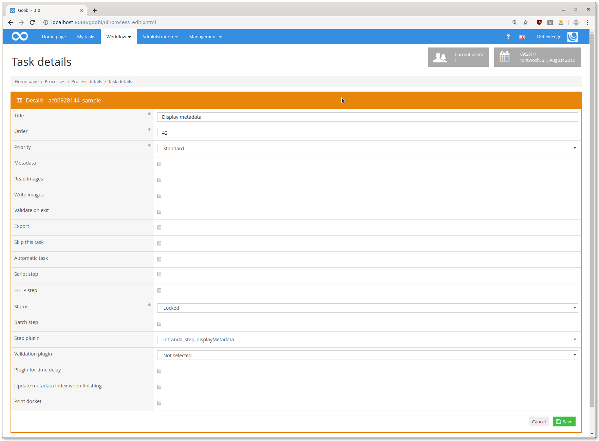

## Introduction
‌This documentation describes the installation, configuration and use of a plug-in to display metadata in a workflow step. The plugin can display any metadata in one step. The configuration of prefixes and suffixes is also possible.


## Installation 
‌To use the plugin, the two artifacts must be copied to the following locations:

```bash
/opt/digiverso/goobi/plugins/step/plugin_intranda_step_displayMetadata-base.jar/opt/digiverso/goobi/plugins/GUI/plugin_intranda_step_displayMetadata-gui.jar
```

‌The configuration of the plugin is expected at the following path:

```bash
/opt/digiverso/goobi/config/plugin_intranda_step_displayMetadata.xml
```


## Overview and functionality
In Goobi, the plugin in the workflow must then be configured. To do this, you must select `intranda_step_displayMetadata` as the step plug-in in the step configuration.



If the step is then opened after successful configuration, all metadata - if available in the process - are displayed:


## Configuration
‌Several metadata can be configured for display, additionally a prefix and a suffix can be displayed. The `key` attribute is used for the translation of the labels of the metadata:

```xml
<?xml version="1.0" encoding="UTF-8"?>
<config_plugin>
    <config>
        <project>*</project>
        <step>*</step>
        <metadatalist>
            <metadata>Author</metadata>
            <metadata>TitleDocMain</metadata>
            <metadata>_urn</metadata>
            <metadata prefix="http://svdmzgoobiweb01.klassik-stiftung.de/viewer/image/" suffix="/1/" key="url">CatalogIDDigital</metadata>
        </metadatalist>
    </config>
</config_plugin>
```